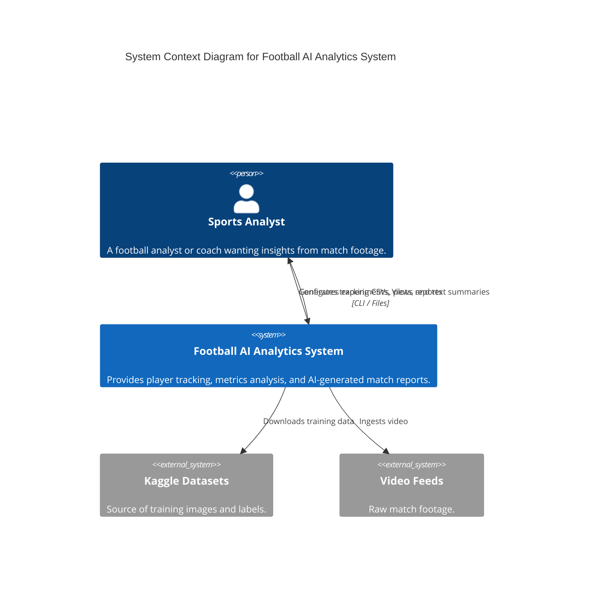
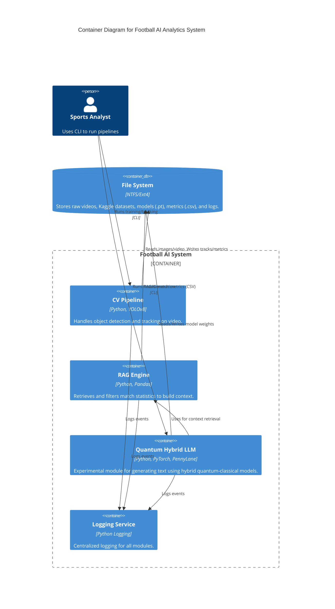
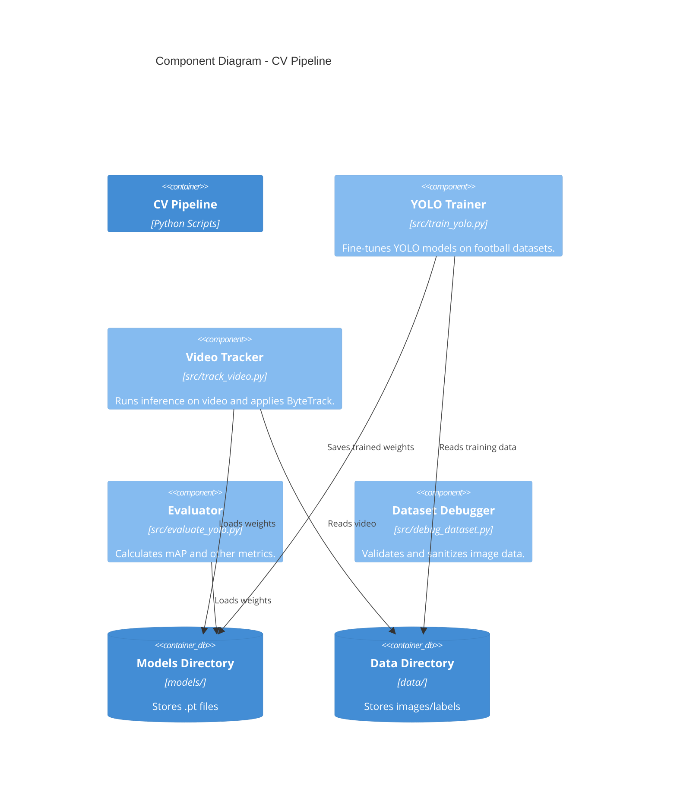
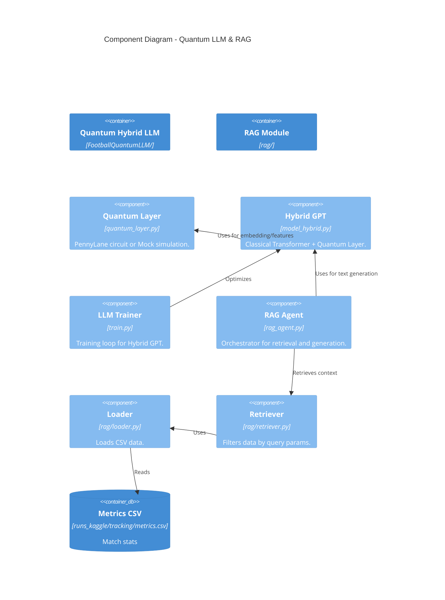
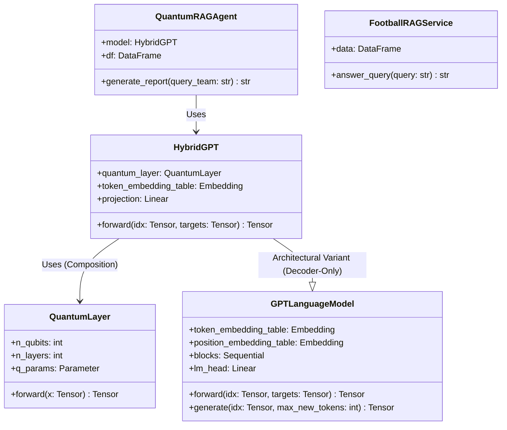

# C4 Architecture - Football AI Analytics System

This document describes the software architecture of the Football AI Analytics System using the C4 model (Context, Containers, Components, Code).

## Level 1: System Context Diagram

The System Context diagram showing how the Football AI Analytics System fits into the world around it.

## Level 2: Container Diagram

The Container diagram shows the high-level technical building blocks.

## Level 3: Component Diagram

The Component diagram shows the internals of the key containers.

### CV Pipeline Components

### Quantum LLM & RAG Components

## Level 4: Code Diagram (Classes)

The Class diagram detailing the `FootballQuantumLLM` and `RAG` implementation.

